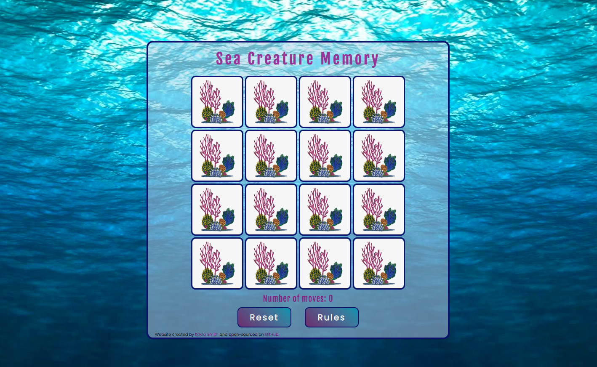
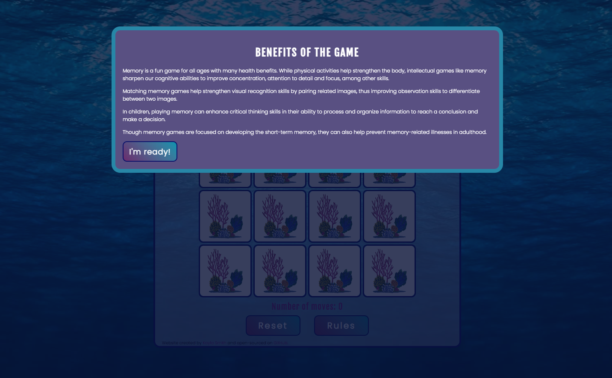
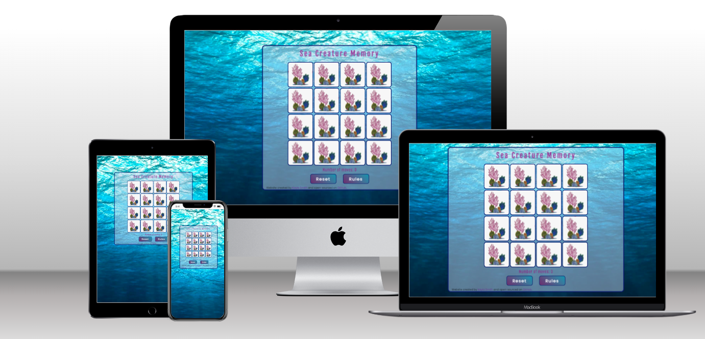
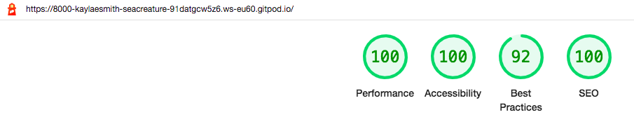

# Sea Creatures Memory Game

This underwater themed memory game is a simple game designed for children but fun for all ages. Sixteen tiles make up a total of eight pairs of animals found in an underwater environment. Using cognitive memory skills, the player flips the cards until all eight matches are found. 

Since the game was originally designed with young children in mind, there is no timer or number of lives included. By taking their time and thinking hard about card placement, a player can strengthen their memory without feeling rushed by a time or 'lives left' constraint. 

## Features 

This interactive website is a 16-tiled memory game with each card dipicting an underwater animal. There are eight animal pairs with one of the eight on each face of the cards; a coral-reef scene is pictured on the back of all cards. The game is won by matching all eight animal pairs.

The game board is set up in a 4x4 grid in an opaque container overlaying a deep underwater photo. Above the gameboard is the title of the game: 'Sea Creature Memory'. Below the grid are two clicable buttons: one to reset the game and the second to see rules of play.

Situated between the gameboard and the clickable buttons, the number of moves is counted. Moves are increased by one after each pair flip, regardless of a match, meaning, theoretically, the game can be won in a minimum of eight moves.

### Existing Features

- __Sixteen clickable cards__

  - The square gameboard is made up of a total of 16 cards that will flip 180° when clicked. 
  - The front face of each card is one of eight underwater animals centered on a white background.

  - The back face of all cards is the same, depicting a coral reef scene on a white background.

 

  - If a match is made, the cards will remain face up until the end of play and the reset button is clicked. If no match is found, both cards will flip back over and remain clickable for future guesses.

 

- __Two clickable buttons__

  - Reset button - The reset button will flip all cards back over so the back face is showing. The cards will be randomized again and the number of moves will be reset to zero. 
  - Rules button - When the rules button is clicked, a responsive message will appear with the rules of the game. To return to the gameboard and play the game, the player will need to click the "Let's play!" button.

    

- __The landing page__

  - The responsive landing page is a text outlining a few important benefits of playing memory. To start playing the game, the player clicks the "I'm ready!" button, the text box disappears and the player can start.

- The responsive game board shows 16 square tiles with a back face image of a coral reef on a white background. A player clicks the cards in an attempt to find a matching pair of underwater animals. Once all 8 pairs are found, the game is won.
- The number of moves is counted and increases by one for every two cards flipped, regardless of a match. This means, the highest possible score is 8 moves.
- In the footer of the opaque game board, I have listed myself as the creator of this website and linked my professional LinkedIn account and the GitHub repository for this project. Both links open in new tabs. 

### Features Left to Implement

- A GIF or a YouTube video on a loop of an underwater scene for the background would be a fun improvement that might give a more realistic effect than a stagnant image. In future, I could explore using keyframes and working with animation of still photos in that way.

- To further increase difficulty, levels could be incorporated to encourage older or more advanced users to play. By adding two or four more pairs, the game could take on a higher skill level. 

  A timer could also clock the player's score, encouraging the player to beat their time in each round.

- Incorporating a "high scores" page would increase interest in the game. The page might include the player's username, number of moves and time it took to win the game. This could be done by saving information in local storage and calling it with a function on the appropriate page. 

## Testing 

- This game was tested on Chrome, Safari and Firefox web browsers using a laptop computer and an Apple mobile phone (iphone 8 plus). It was designed to be responsive on a range of devices, using the Responsive setting on Chrome DevTools to simulate sizes. 

- Both links in the footer of the gameboard work properly and open in new tabs when clicked. 

- I ran each aspect of the page through Lighthouse separately in Chrome DevTools using display block or display none to target the benefits, gameboard and rules sections. The desktop and mobile version results are show below. 

  The two final scores are of the webpage tested as a whole, simulating a live environment. The results are for desktop and mobile.

Landing page, benefits overlay only (desktop and mobile)

Gameboard only (desktop and mobile)

Rules overlay only (desktop and mobile)

Full game (desktop and mobile)

- I also ran the project through [WAVE](https://wave.webaim.org/). The 15 warnings seen below are due to identical alt attribute naming. All cards have alt="sea-animal" for the front face and alt="coral-reef" for the back face. This does not show a warning for back face cards as the image is the same on all.

- This project was also submitted on the peer-code-review Slack channel but no feedback was given.

### Validator Testing 

- HTML
  - No errors were found when the code was passed through the official [W3C validator](https://validator.w3.org/nu/?doc=https%3A%2F%2Fcode-institute-org.github.io%2Flove-running-2.0%2Findex.html).

  
- CSS
  - No errors were found when passing through the official [(Jigsaw) validator](https://jigsaw.w3.org/css-validator/validator?uri=https%3A%2F%2Fvalidator.w3.org%2Fnu%2F%3Fdoc%3Dhttps%253A%252F%252Fcode-institute-org.github.io%252Flove-running-2.0%252Findex.html&profile=css3svg&usermedium=all&warning=1&vextwarning=&lang=en#css) though there was a warning. I believe this could be attributed to importing font styles from Google Fonts at the top of the style.css page.
  
  

- JavaScript
  - No errors were found in the JavaScript file when it was run through the [(JShint) validator](https://jshint.com/) but there were warnings, an excerpt of which is shown in the first screenshot below. The second screenshot was taken after I rectified the original issues.

### Bugs Encountered and Improvements

- To my knowledge are there no unfixed bugs. I will detail below the bugs I identified throughout the creation of this game and the steps I took to solve the issues. 

__Safari Bugs__ 
- There were problems with Safari on a laptop computer that, to my knowledge, were fixed by running the CSS through the [Autoprefixer CSS](https://autoprefixer.github.io/) website. 

  

- I also encountered issues with Safari on a mobile device (iphone 8 plus); the buttons in the overlay sections (benefits and rules) were aesthetically unresponsive. This had been tested using the 'Responsive' setting on a laptop when writing CSS so I am unsure why it broke in production. This was fixed by changing the margin of these two buttons by 1rem in media queries.

  

  

- Lastly using Safari, the cards flipped properly (and flipped back) on a mobile device but did not show the animal image on the card faces. Instead they showed a mirrored version of the back face. 

  I believe this was fixed by using the Autoprefixer for CSS and tests run by a friend on her mobile device using Safari. However, on my personal mobile, it still appears broken. 

__Accessibility Bugs__
- I ran the project through [WAVE](https://wave.webaim.org/) that returned 32 errors at the outset.  All were accredited to the lack of alt attributes on img files. I assigned the same alt="sea-animal" to the front face of all cards, though there are different images, and the same alt="coral-reef" to the back face of the cards, which has resulted in a 'warning' in the final WAVE report. An image of the final report can be seen above in the Testing section. The image below includes the original error message.

- I received lower overall scores on Lighthouse for the full game and for the gameboard separately, both on desktop and mobile. After consulting the report, it appeared the complaint had to do with missing alt attributes on img files, which was the same complaint from WAVE. I have added alt attributes and the Lighthouse score reflects those changes. Images of the final results from Lighthouse can be seen above in the Testing section. The images below show scores earned on the full game and the game board, respectively, before alt attirbutes were added to the images.

Full game (desktop and mobile)

Game board (desktop and mobile)

__Other Bugs__
- The "reset" and "rules" buttons were aligned to the left though I had programmed them to be center-aligned through CSS. Something was overwriting the center alignment. 

  I asked for help in a Slack channel and a fellow student, Eoghan Behan, provided a solution to remove the margin: auto I had, add a display: flex and align and justify the items to center. This worked and I kept this solution in the final project.

- On clicking two cards that didn't match, both remained face up and listed the pair as a match in the console. The idea was for non-matcing cards to automatically flip back over. I received help from one of the tutors, Sean, who alerted me to event bubbling and the use of 'event.currentTarget' to remove the toggle class on my cards and ensure they flipped automatically. We also discussed and fixed the erroneous 'match' in the console.

- At one point my images were not displaying properly. This was due to having called them incorrectly. I fixed this by right clicking an image in my folder and looking at the relative path. I then changed the folder my images were save in, therefore, the correct path was called and now they are all showing properly. The image below is before the location change.

- Clicking the "rules" button did not correctly execute my eventListener to display my rules overlay. I consulted a [YouTube video](https://bobbyhadz.com/blog/javascript-cannot-read-property-addeventlistener-null) but the problem was my const rulesButton variable was calling a rules ID (#rules) rather than the rules class (.rules) I had created in my HTML. This is fixed now. 

## Deployment

I deployed this website to GitHub pages on the GitHub hosting platform following the steps below: 

  - Once in my personal GitHub repository for this project, I clicked the Settings cog button.
  - From there I clicked 'Pages' from the left side menu. 
  - Next under 'Source' I selected the main branch,  refreshed the page and a link to the live site was provided, indicating successful deployment.

  

The live link can be found here - https://kaylaesmith1.github.io/sea-creature-memory-game/

## Credits 
### Content 

- I used fonts from [Google Fonts](https://fonts.google.com/) for this project. The squid icon on the left side of the browser tab was created using [Favicon](https://www.favicon.cc/) with an image from a Google search.

- I used Stack Overflow for general troubleshooting and issues with grid spacing and to add alt attributes in Javascript to my images.

- The images used for the front and backs of the cards and the underwater image background are all from a Google search.

- Information for the landing page overlay, "Benefits of the game" was taken from the [Walnut Montessori-Preschool Academy](https://www.walnutmontessori-preschool.com/why-kids-should-play-memory) website.

- I would like to acknowledge Code Institue's tutor, Sean, in helping solve a problem I had with an eventListener. He helped me work through the problem, ultimately giving a solution that worked and that I implemented in the final project. He also supplied further information to learn about event bubbling, a concept I'd not seen before.

- Feedback and comments from the reviewer of my PP1 were taken into account for this project when running tests and identifying and fixing bugs. Per their suggestion, I have included screenshots of bugs in this README file to better document the solution process. I have also ensured my images are clear and high-quality, which was another suggestion from my PP1.

- Colleagues and mentors on the slack channels have also been helpful, specifically Eoghan Behan who gave a solution to a problem with button alignment on the gameboard page. By removing the specific margin and using display: flex; I was able to justify and center the content. The buttons appear centered now in the final project.

  I consulted our cohort leader, Sawyer, and cohort mentor, Alexandru, about questions regarding JavaScript testing on JShint. Both helped with configuration issues.

- Finally, I would like to thank my mentor, Harry, for guiding me at the outset of PP2 in keeping in mind the assessment criteria and the importance of working through and validating each section of JavaScript as you go. 
  
  He suggested that I work on the functionality of the actual game first and then tackle the CSS, which was good adivce. He also helped me work through the logic of adding alt attributes to img files in a JavaScript array as I'd only had experience adding them to HTML code. His solution resulted in higher Lighthouse scores and no errors in my WAVE report.
  
  He has been quick to give helpful feedback during this process and is always available. I appreciate his insight and professional experience in the field.

### Media

- I found a [YouTube tutorial](https://www.youtube.com/watch?v=-tlb4tv4mC4) that I used for help in writing an array in JavaScript for the gameboard layout. I also followed his style of writing the functions to create this game. 